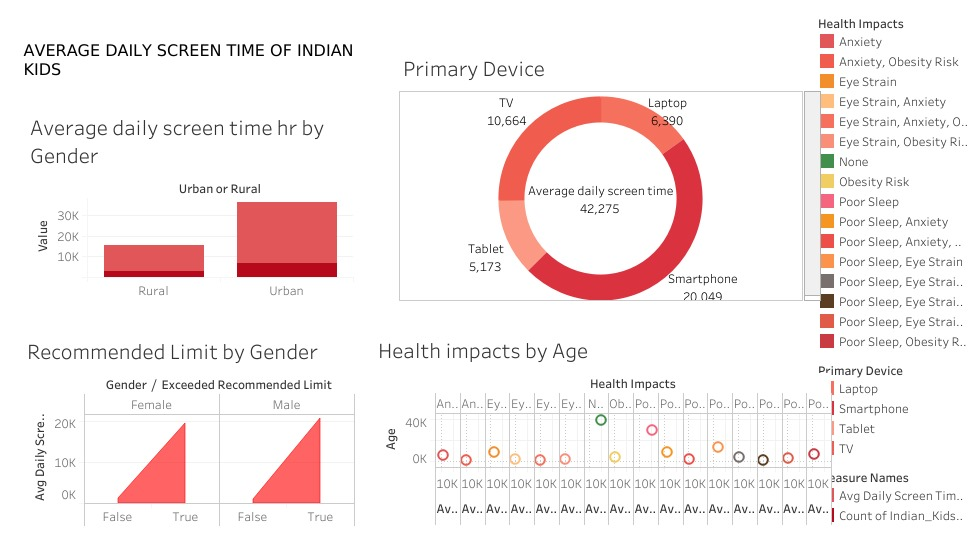

# 📱 Average Daily Screen Time of Indian Kids – Tableau Dashboard

This Tableau dashboard explores the **average daily screen time** of Indian children, segmented by gender, urban/rural background, device usage, and the associated health impacts. It provides a visual overview to help educators, parents, and researchers understand how screen habits vary and what they might affect.

---

## ✅ Key Insights

- **Urban kids** have significantly more screen time than rural kids  
- **Smartphones** are the most-used devices  
- Many kids **exceed the recommended screen time limit**  
- Health issues like **eye strain, poor sleep, anxiety**, and **obesity risk** are linked to excessive screen time  
- Analysis is broken down by **age**, **gender**, **primary device**, and **impact**

---

## 📊 Dashboard Preview

---

## 🛠 Tools Used

- **Tableau Public** – for interactive visualization  
- **Excel/CSV** – as the source of the dataset  

---

## 📁 Files Included

- `screen_time_dashboard.twbx` – Tableau workbook  
- `indian_kids_screen_time.csv` – Raw dataset  
- `INDIAN_KIDS_DAILY_AVERAGE_SCREEN_TIME.jpg` – Dashboard image  
- `README.md` – This documentation file  

---

## 🔗 View the Interactive Dashboard

[Click here to view on Tableau Public]([https://public.tableau.com/app/profile/YOUR_USERNAME/viz/YOUR_DASHBOARD_NAME](https://public.tableau.com/views/AVERAGEDAILYSCREENTIMEOFINDIANKIDS/Dashboard1?:language=en-US&:sid=&:redirect=auth&:display_count=n&:origin=viz_share_link))

## 📌 About the Project

This project was created to raise awareness of digital behavior among Indian children. It’s designed to:
- Highlight screen usage trends
- Support policy makers, NGOs, and educators
- Encourage healthier digital habits

---

## 💼 Interested in Working With Me?

I create custom Tableau dashboards and insightful visualizations for:
- Education
- Healthcare
- Market research
- Business KPIs  

Let’s connect on **LinkedIn** or **Fiverr**!
